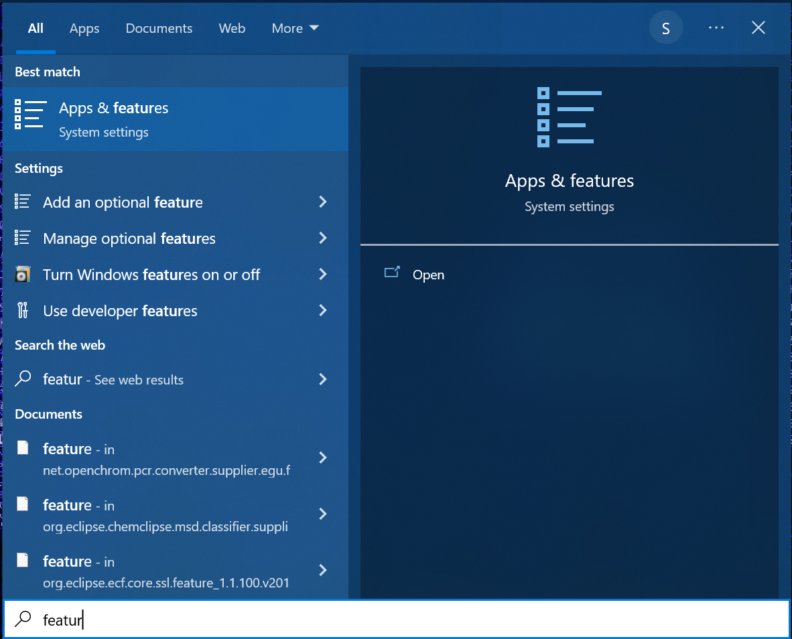
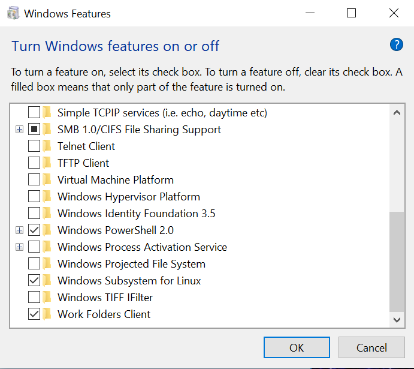
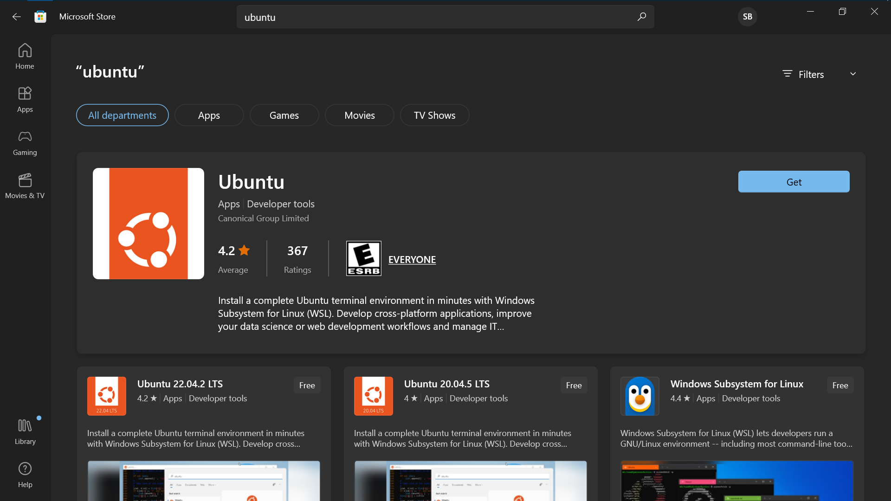
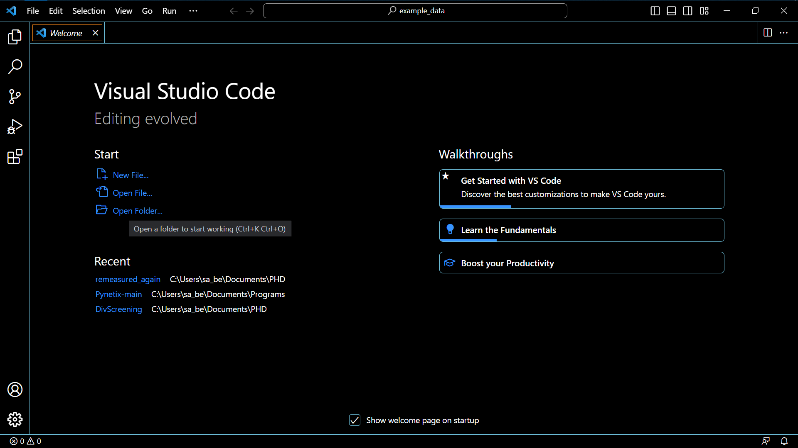
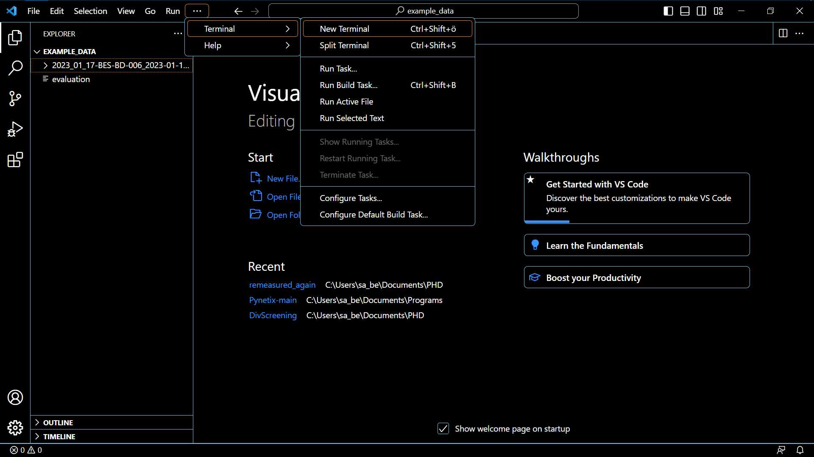
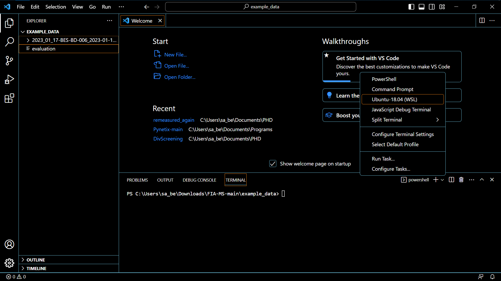

# FIA-MS
## [Paper on FIA-MS](insertlinkhere)

Bash and Python script for data-extraction from FIA-MS reports on a Shimadzu HPLC-MS system for HTS for unlimited number of samples (in this case 96).
It is recommended to use the bash script. The python-version can be used to just extract the data from the corresponding text-files after they were extracted with the bash-script _extract-data_.
The script _evaluation_ converts the pdf-report to a text file, using pdftotext (a command line tool). From this text files, the corresponding mass signals are extracted and printed to a simple output file, containing the mass signals in columns. This columns can then be pasted into an excel-template for further data evaluation.

If you have questions, please feel free to message me on Github or per mail: [sarah.berger@uni-graz.at](sarah.berger@uni-graz.at)

# Prerequisits

* Windows 10 or Windows 11
* Windows Subsystem Linux (WSL)
* Install [Visual Studio Code](https://code.visualstudio.com/) (VSC)

## How to enable WSL?

* Open the start menu and search "features"

* Select Turn Windows features on or off
* Scroll to the very bottom and check _Windows Subsystem for Linux_ (reboot required)

* Install Ubuntu from the Microsoft Store (version tested 18.04.5)

# Working with Visual Studio Code

* Open VSC
* Select _Open Folder_ and choose the folder, where your data is stored (here I chose the example folder in this repository)

* Copy the evaluation script (bash-version/evaluation) to this folder
* Open a terminal in VSC

* Be sure it is not a Windows Powershell terminal, but an Ubuntu terminal

## Set up environment
* If it is a fresh WSL-Ubuntu install, be sure to run
~~~bash
sudo apt-get update
sudo apt-get upgrade
~~~
  this will make sure, everything will work smoothly. You need to do this just once.
* run the following to install the requirement for the extraction script:
~~~bash
sudo apt-get install poppler-utils
sudo apt-get install rename
~~~
* Run the script with:
~~~bash
bash ./evaluation
~~~
* This script works also if multiple folders from different experimental runs are present. For each, an output will be generated.
The log-file which you receive as an output can be opened with a simple text-editor.

## Citation
Add bibtex here.

## License
MIT
